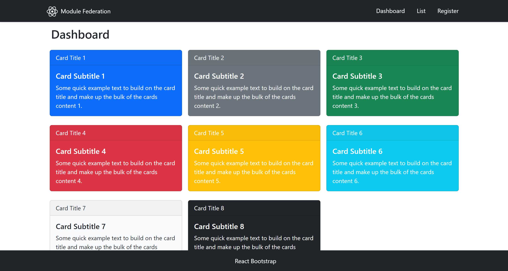
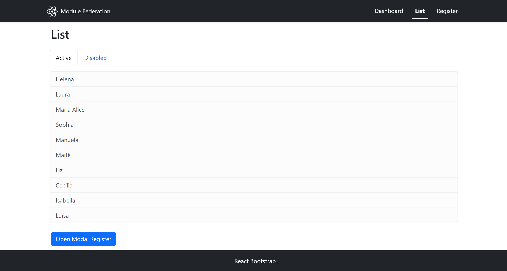
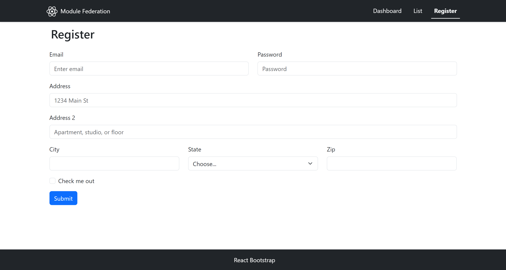
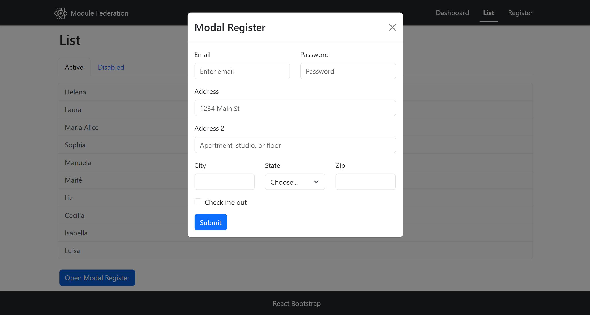

# Webpack do básico ao avançado module federation

Esse aplicativo foi desenvolvido no curso <a href="https://www.udemy.com/course/webpack-do-basico-ao-avancado-com-projeto/" target="_blank">Webpack do básico ao avançado</a> , e teve como objetivo aprender tudo o que é necessário para trabalhar com Webpack.

## ✔️ Host demo 
<a href="https://host-five-tan.vercel.app/" target="_blank">Link</a>
|Host Dashboard|Host List|Host Register|Host Modal Register|
|------|------|------|------|
|||||

## 🔨 Funcionalidades do projeto

Esse aplicativo é uma SPA criada com micro frontends.

## ✔️ Técnicas e tecnologias utilizadas

Lista das bibliotecas utilizadas no desenvolvimento da plicação webpack module federation:

- `react`
- `react-dom`
- `react-router-dom`
- `webpack`
- `webpack-cli`
- `webpack-dev-server`
- `html-webpack-plugin`
- `file-loader`
- `css-loader`
- `file-loader`

## 🛠️ Abrir e rodar o projeto

Navega para pasta de cada micro front end execute npm i ou yarn para instalar as dependências e npm start ou yarn start para iniciar o projeto.

1. Micro front end `dashboard` :
   ```shell
   cd dashboard  
   yarn
   yarn start
   ```
2. Micro front end `list` :
   ```shell
   cd list  
   yarn
   yarn start
   ```
3. Micro front end `register` :
   ```shell
   cd register  
   yarn
   yarn start
   ```
4. Micro front end `host` :
   ```shell
   cd host  
   yarn
   yarn start
   ```
Depois, acesse <a href="http://localhost:9001/" target="_blank">http://localhost:9001/</a> no seu navegador. 

